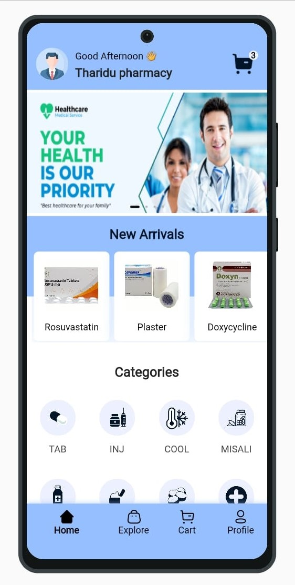
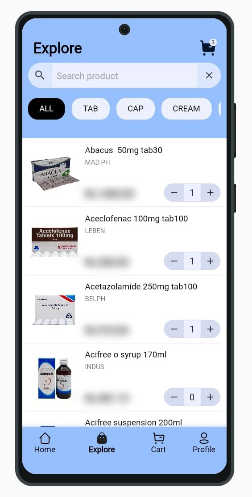
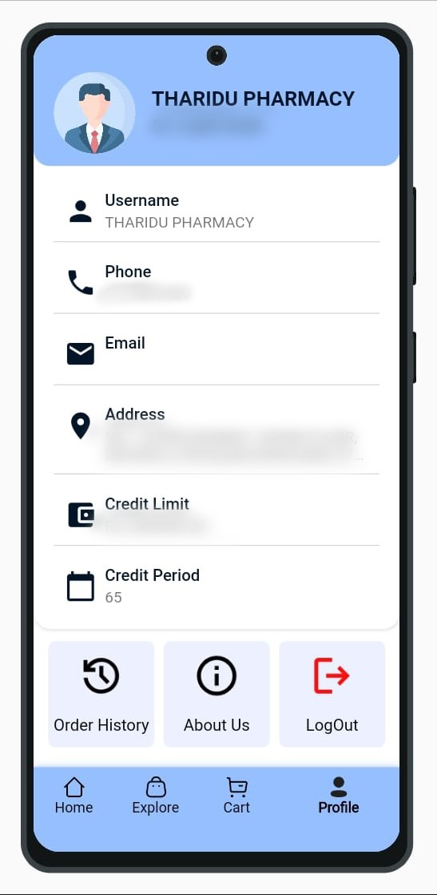
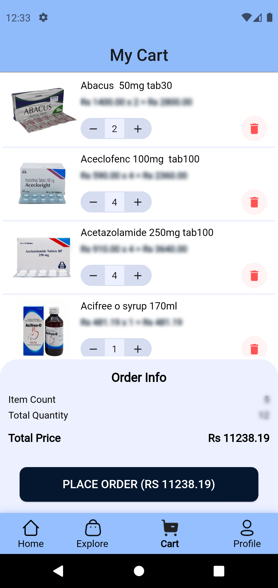
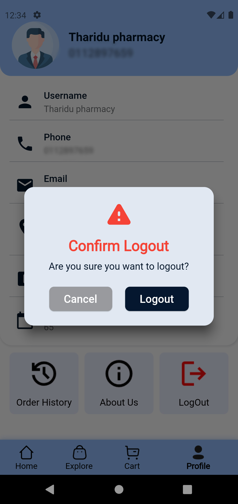

# PharmacyWholesalerApp

A fully functional Flutter app designed for pharmacy wholesalers in Sri Lanka. The app streamlines the process of ordering pharmacy items for retail pharmacies, handling everything from item selection to order placement. State management is implemented using the Provider package.

## Features

- Comprehensive item selection for pharmacy products
- Seamless order placement process
- State management using Provider
- User-friendly interface for retail pharmacies

  ##ScreenShots
  
  <table>
  <tr>
    <td></td>
    <td></td>
    <td></td>
    <td></td>
  </tr>
  <tr>
    <td></td>
    <td></td>
    <td></td>
    <td></td>
  </tr>
</table>

## Packages Used

- [flutter](https://pub.dev/packages/flutter)
- [provider](https://pub.dev/packages/provider)
- [http](https://pub.dev/packages/http)
- [shared_preferences](https://pub.dev/packages/shared_preferences)
- [firebase_core](https://pub.dev/packages/firebase_core)
- [firebase_auth](https://pub.dev/packages/firebase_auth)
- [cloud_firestore](https://pub.dev/packages/cloud_firestore)
- [firebase_storage](https://pub.dev/packages/firebase_storage)
- [intl](https://pub.dev/packages/intl)
- [cached_network_image](https://pub.dev/packages/cached_network_image)
- [image_picker](https://pub.dev/packages/image_picker)
